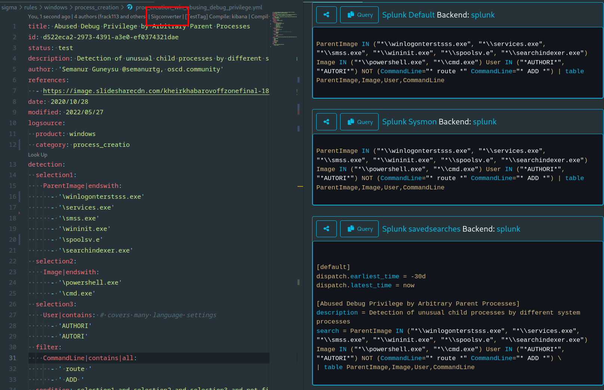

# Sigma VsCode Extension

<a href="https://sigmahq.io/">
<p align="center">
<br />
<picture>
  <source media="(prefers-color-scheme: dark)" srcset="./images/sigma_logo_dark.png">
  
</picture>
</p>
</a>
<br />

This [extension](https://marketplace.visualstudio.com/items?itemName=humpalum.sigma) will enhance your VSCode for the [Sigma signature format](https://github.com/SigmaHQ/sigma)

- [Sigma VsCode Extension](#sigma-vscode-extension)
  - [Installation](#installation)
  - [Features](#features)
    - [Snippets](#snippets)
    - [Diagnostics](#diagnostics)
    - [Automatic continuation of lists](#automatic-continuation-of-lists)
    - [Tags](#tags)
    - [Sigconverter.io codelens](#sigconverterio-codelens)
    - [Sigmac compile (deprecated)](#sigmac-compile-deprecated)
    - [Webextension Support (Quite untested)](#webextension-support-quite-untested)
    - [Sigma Search Engine Integration](#sigma-search-engine-integration)
  - [Requirements](#requirements)
  - [Extension Settings](#extension-settings)
  - [Known Issues](#known-issues)
  - [Changelog](#changelog)

Checkout Ideas.md for planned features!

## Installation

Simply grab it in the [VSCode marketplace](https://marketplace.visualstudio.com/items?itemName=humpalum.sigma).

Install it from VSCode in the Extension Tab (Ctrl + Shift + X) and search for Sigma.

-   Setup your Author name in the extensions config section. `sigma.author`
-   Setup your sigmac compile configs in `sigma.compileConfig`
    -   For example:
    ```json
    [
        {
            "tag": "OptionalTag",
            "target": "kibana",
            "config": ["~/sigma/tools/config/winlogbeat.yml"],
            "additionalArgs": ""
        },
        {
            "target": "splunk",
            "config": ["~/sigma/tools/config/generic/windows-audit.yml", "~/sigma/tools/config/splunk-windows.yml"]
        }
    ]
    ```

## Features

### Snippets

The extension offers various snippets to streamline the sigma rule creation process:

-   `newrule` Snippet


-   `title`
-   `id`
-   `related`
-   `status`
-   `reference` (links will be auto-pasted)


-   `author`
-   `date`/`modified`
-   `tags`
-   `logsource`
    -   `category`
    -   `product`
    -   `service`


-   `falsepositives`
-   `level`

### Diagnostics

The extension will perform some sanity checks on the sigma rule itself on the fly to make sure that it's confomring with the sigma standard and the SigmaHQ conventions and guidelines. A list of the currently implemented checks is availbale below

-   Title too Long
-   Description too Short
-   'contains' at wrong position in modifiers
-   Whitespace at end of Line
-   Single Item with All modifier
-   YAML not parsing
-   Various Tests from the official sigma repo

Quickfixes for some of the Diagnostics


### Automatic continuation of lists

Lists will be automatically continued by pressing the enter key.  
Use the `CTRL` (`Command` on Mac) modifier to create a new line regardless of the curent position of the cursor.
Use the `Shift` modifier to ignore this feature.  
When there is an empty string, it gets deleted.


### Tags

-   Hover for attack Tags
-   Adding new Tags per command


### Sigconverter.io codelens

-   Click on the `Sigconverter`-Codelens in the first line convert your sigma rule with sigconverter.
-   You can define multiple sigconverter configs in the `sigma.sigconverterConfigs` setting. Here are some example configurations:

```json
[
    {
        "name": "Splunk Default",
        "backend": "splunk"
    },
    {
        "name": "Splunk Sysmon",
        "pipeline": ["sysmon"]
    },
    {
        "name": "Splunk savedsearches",
        "backend": "splunk",
        "format": "savedsearches"
    },
    {
        "name": "Elasticsearch custom pipeline",
        "backend": "elasticsearch",
        "pipelineYML": ["/home/tobias/tmp/sigma/pipe.yml", "/home/tobias/tmp/sigma/pipe2.yml"]
    }
]
```



### Sigmac compile (deprecated)

After defining your sigmac configs, click on the codelens in the first line. The compile sigma rule will be in your clipboard.

### Webextension Support (Quite untested)

The extension can be used in github vscode mode and on vscode.dev.
However these are not really tested, so in case you find bugs with it, feel free to open an issue.

### Sigma Search Engine Integration

Integration of https://sigmasearchengine.com/.

-   `Look Up Related` --> Look up related Sigma rules (see codelense above `related`)
-   `Look Up` --> Look for similar rules with multiline selection (see codelense above `detection`)
-   Hovering over `detection`-strings --> Look for similar rules

## Requirements

For sigmac compilation: sigmatools

```
pip install sigmatools
```

## Extension Settings

-   sigma.author: Set this for the newRule and author snippet
-   sigma.debug: If true, debug messages will be printed in console
-   sigma.CompileConfig: SigmaC config to be used in codelens
-   sigma.sigconverterBackend: Sets the target backend to be used for sigconverter
-   sigma.sigmasearchengineurl: Lets you use your own sigmasearchengine
-   sigma.sigconverterUrl: Lets you use your own instance of sigconverter
-   sigma.sigconverterEnabled: Enables the Sigconverter Feature
-   sigma.sigconverterConfigs: Lets you configure multiple configurations for the sigconverter codelens

## Known Issues

Only Files that are opened and begin with `title:` are set as `sigma`

## Changelog

Check out [CHANGELOG](CHANGELOG.md) for more information.
