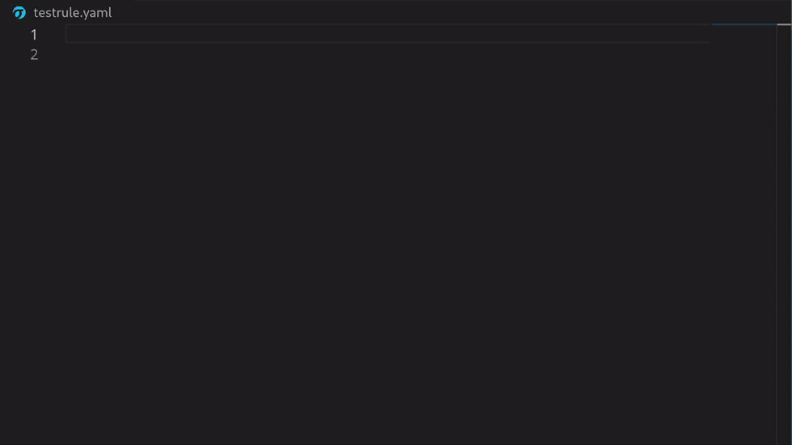
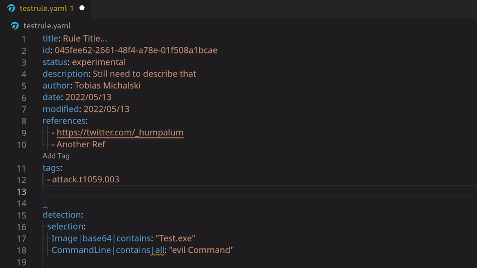
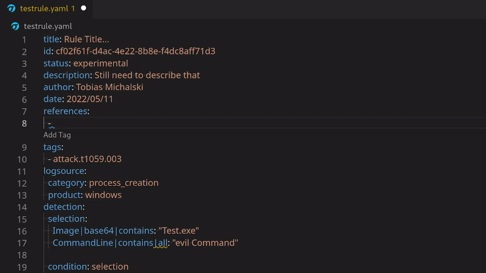
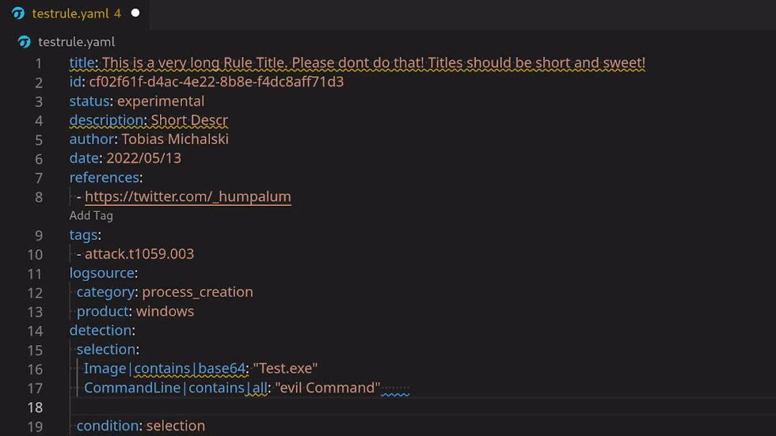
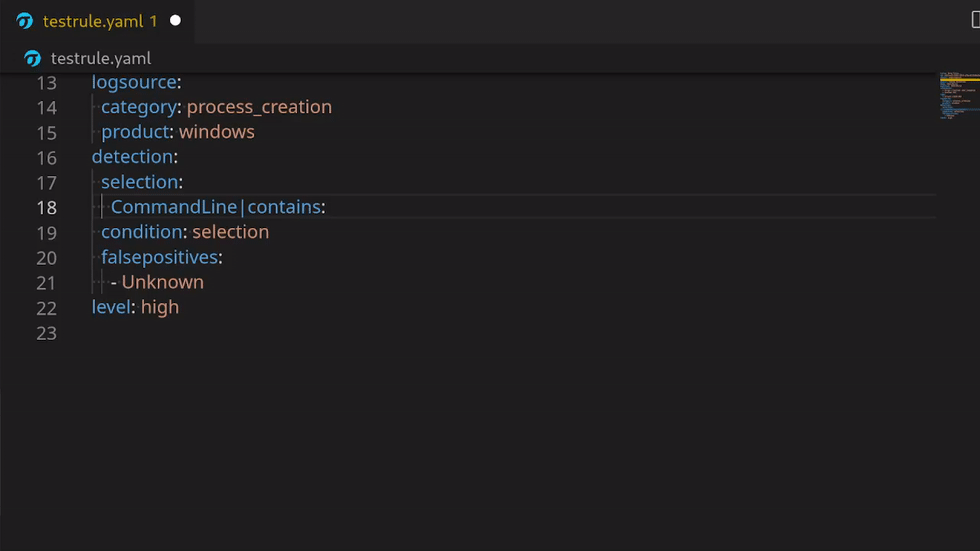
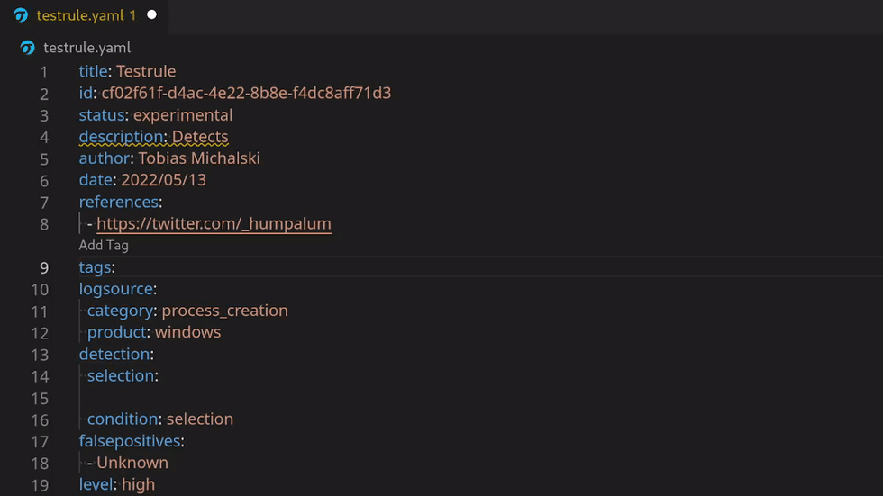
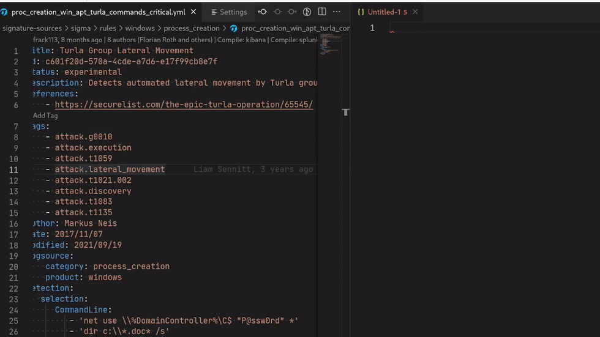

# sigma

This [extension](https://marketplace.visualstudio.com/items?itemName=humpalum.sigma) will enhance your VSCode for the [Sigma signature format](https://github.com/SigmaHQ/sigma)

- [Installation](#installation)
- [Features](#features)
  - [Snippets](#snippets)
  - [Diagnostics](#diagnostics)
  - [Automatic continuation of lists](#automatic-continuation-of-lists)
  - [Tags](#tags)
  - [Webextension Support (Quite untested)](#webextension-support-quite-untested)
- [Requirements](#requirements)
- [Extension Settings](#extension-settings)
- [Known Issues](#known-issues)
- [Changelog](#changelog)


Checkout Ideas.md for planned features!
## Installation
Simply grab it in the [VSCode marketplace](https://marketplace.visualstudio.com/items?itemName=humpalum.sigma).  
Install it from VSCode in the Extension Tab (Ctrl + Shift + X) and search for Sigma.  
- Setup your Author name in the extensions config section. `sigma.author`
- Setup your sigmac compile configs in `sigma.compileConfig`
  - For example:
  ``` json
  [
   {
      "tag": "OptionalTag",
      "target": "kibana",
      "config":["~/sigma/tools/config/winlogbeat.yml"],
      "additionalArgs": ""
    },
    {
      "target": "splunk",
      "config":["~/sigma/tools/config/generic/windows-audit.yml","~/sigma/tools/config/splunk-windows.yml"]
    }
  ]
  ```


## Features
### Snippets
Various Snippets:
- new Rule Snippet

- auto uuid
- automatic Author
- Date/modifiedDate
- logsource
  - category
  - product



- falsepositives
- status
- level
- title
- reference (links will be auto-pasted)


### Diagnostics
- Title too Long
- Description too Short
- 'contains' at wrong position in modifiers
- Whitespace at end of Line
- Single Item with All modifier
- YAML not parsing
- Various Tests from the official sigma repo

Quickfixes for some of the Diagnostics



### Automatic continuation of lists
Lists will be automatically continued by pressing the enter key.  
Use the `CTRL` (`Command` on Mac) modifier to create a new line regardless of the curent position of the cursor.
Use the `Shift` modifier to ignore this feature.  
When there is an empty string, it gets deleted.



### Tags
- Hover for attack Tags
- Adding new Tags per command



### Sigmac compile
After defining your sigmac configs, click on the codelens in the first line. The compile sigma rule will be in your clipboard.


### Webextension Support (Quite untested)
The extension can be used in github vscode mode and on vscode.dev.
However these are not really tested, so in case you find bugs with it, feel free to open an issue.

## Sigma Search Engine Integration
Integration of https://sigmasearchengine.com/.
* `Look Up Related` --> Look up related Sigma rules (see codelense above `related`)
* `Look Up` --> Look for similar rules with multiline selection (see codelense above `detection`)
* Hovering over `detection`-strings --> Look for similar rules

## Requirements

For sigmac compilation: sigmatools
```
pip install sigmatools
```

## Extension Settings

- sigma.author: Set this for the newRule and author snippet
- sigma.debug: If true, debug messages will be printed in console

## Known Issues
Only Files that are opened and begin with `title:` are set as `sigma`

## Changelog
Check out  [CHANGELOG](CHANGELOG.md) for more information.
